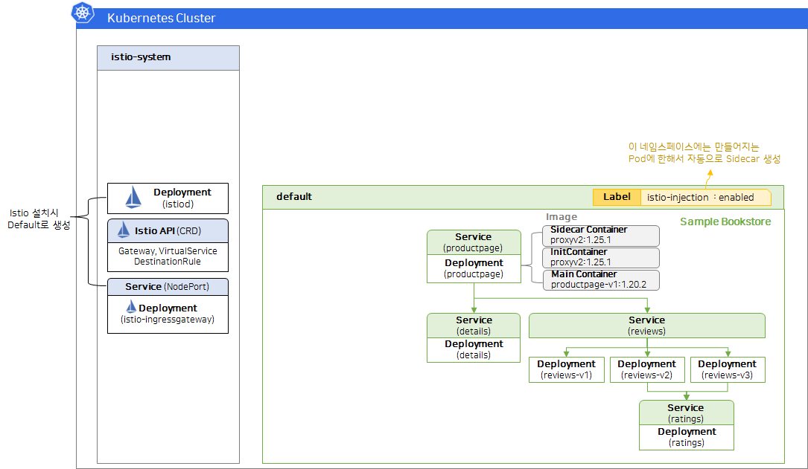
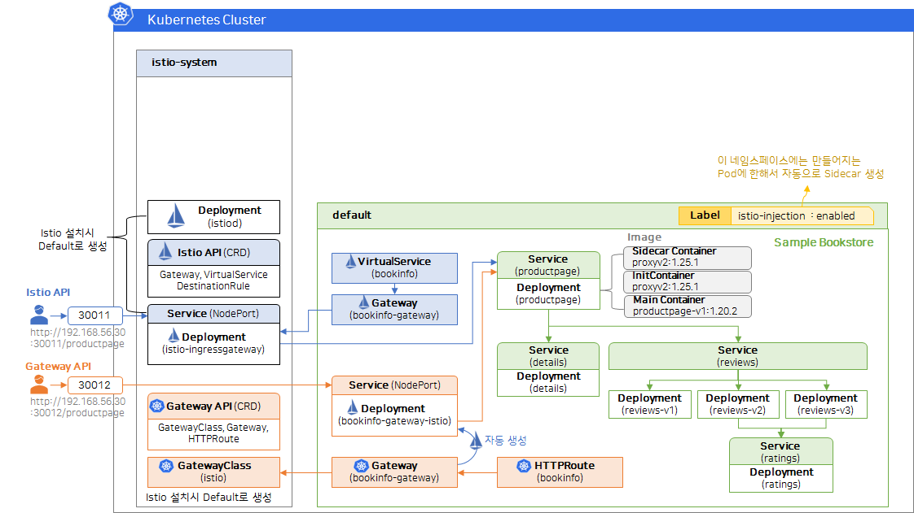
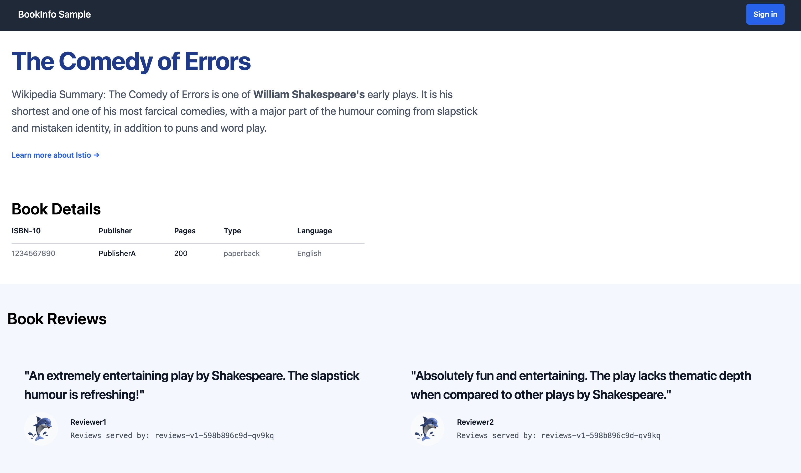
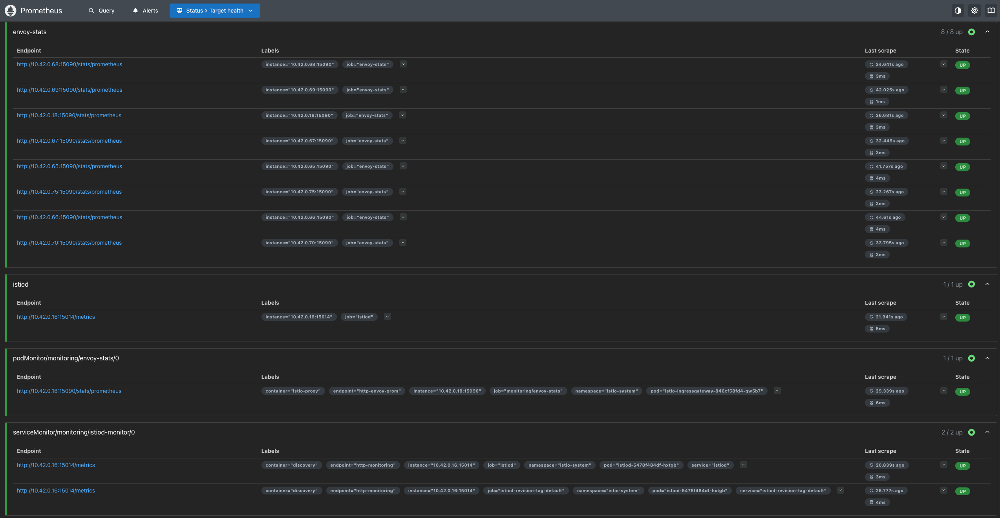
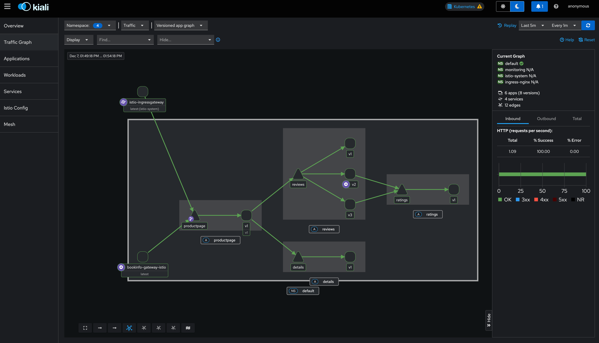

# Istio Install Guide (Mac)

---

## 1. Makefile 기반 실행 (추천)

- Init 모드 설치: `make istio-install-init`
- CNI 모드 설치: `make istio-install-cni` (`ISTIO_OVERLAY_CNI=./istio-cni.yaml` 기본값 사용)
- 설치 검증: `make istio-verify`
- 삭제: `make istio-uninstall` (CRD까지 삭제하려면 `ISTIO_PURGE=true make istio-uninstall`)
- 모니터링 스택(kube-prometheus-stack + Kiali): `make monitoring-install` / `make monitoring-delete`
- 기본 컨텍스트는 `KUBE_CONTEXT=rancher-desktop`이며, 필요하면 환경변수로 덮어쓸 수 있습니다.

[KubeOps - [이스티오(Istio) 시작하기] Istio 설치하기](https://cafe.naver.com/kubeops/821)
[Istio Docs - Getting Started](https://istio.io/latest/docs/setup/getting-started/)
[Istio GitHub](https://github.com/istio/istio)


---

## 2. What is Istio?

[Istio Docs - What is Istio?](https://istio.io/latest/docs/overview/what-is-istio/)

Istio는 마이크로서비스 아키텍처에서 서비스 간의 통신을 관리하고 보안을 강화하며 관찰성을 제공하는 오픈소스 서비스 메쉬 플랫폼입니다. Istio는 다음과 같은 주요 기능을 제공합니다.

- 상호 TLS 암호화, 강력한 ID 기반 인증 및 권한 부여를 통해 클러스터 내에서 안전한 서비스 간 통신 제공
- HTTP, gRPC, WebSocket 및 TCP 트래픽에 대한 자동 부하 분산
- 풍부한 Routing Rules, Retries, Failovers 및 오류 주입을 통해 트래픽 동작을 세부적으로 제어
- Access Control, Rate Limits 및 Quotas를 지원하는 플러그형 정책 계층 및 구성 API
- 클러스터 ingress 및 egress를 포함한 클러스터 내의 모든 트래픽에 대한 자동 메트릭, 로그 및 추적

Istio는 확장성을 염두에 두고 설계되어 다양한 배포 요구 사항을 처리할 수 있습니다. Istio의 컨트롤 플레인은 Kubernetes에서 실행되며, 해당 클러스터에 배포된 애플리케이션을 메시에 추가하거나, 메시를 다른 클러스터로 확장하거나, Kubernetes 외부에서 실행되는 VM 또는 기타 엔드포인트와도 연결할 수 있습니다.

### 2.1. How it works

Istio는 Proxy를 사용하여 모든 Network Traffic을 가로채며, 사용자가 설정한 구성에 기반해 애플리케이션을 이해하는 다양한 기능을 제공합니다.

- Istio는 각 서비스 옆에 sidecar proxy(Envoy) 를 배치하고
- 이 프록시가 서비스로 들어오고 나가는 모든 트래픽을 통제하며
- 사용자가 설정한 VirtualService, DestinationRule, Policy 등을 기반으로 라우팅, 보안, 관측 기능을 제공

---

## 3. Sidecar Mode vs Ambient Mode

[Sidecar Mode vs Ambient Mode](https://istio.io/latest/docs/overview/dataplane-modes/)

Istio는 두 가지 주요 Data Plane 모드를 제공합니다.

1. Sidecar Mode: 클러스터에서 실행하는 각 Pod(또는 VM에서 실행되는 서비스) 옆에 Envoy 프록시를 함께 배포하는 방식
2. Ambient Mode: 노드 단위로 실행되는 L4 프록시를 사용하며, 필요한 경우 L7 기능을 위해 네임스페이스 단위의 Envoy 프록시를 추가로 사용

| 구분                               | **Sidecar Mode**                                             | **Ambient Mode**                                                                           |
| ---------------------------------- | ------------------------------------------------------------ | ------------------------------------------------------------------------------------------ |
| **구조(Architecture)**             | 각 Pod 옆에 Envoy sidecar proxy 주입                         | Pod에는 proxy 없음. Node 단의 **ztunnel(L4)** + Namespace 단의 **Waypoint(L7 Envoy)** 구성 |
| **트래픽 처리 방식**               | Pod 내부에서 Envoy가 모든 트래픽(L4+L7)을 직접 가로채고 처리 | **L4는 ztunnel**, **L7 정책은 Waypoint Envoy**가 처리 (역할 분리)                          |
| **주요 목적**                      | 고급 L7 제어, 앱마다 완전한 Envoy 기능 제공                  | Sidecar 없이 서비스 메시 운영 간소화 + 성능·비용 최적화                                    |
| **애플리케이션 변경 필요 여부**    | Sidecar 업데이트 시 **Pod 재시작 필요**                      | 메시 기능 적용/해제 시 **Pod 재시작 없음**                                                 |
| **리소스 오버헤드**                | Pod마다 Envoy 하나씩 -> CPU/RAM 증가                         | ztunnel 공유 + Waypoint 선택적 사용 -> **리소스 효율 높음**                                |
| **L7 기능 제공 방식**              | 모든 Pod가 L7 Envoy 기능 전체 사용                           | L7 기능은 필요할 때만 Waypoint 배치하여 사용                                               |
| **보안(mTLS/Identity)**            | 모든 Pod 사이 직접 mTLS 연결 수행                            | ztunnel이 통합 L4 보안(mTLS, identity)을 처리                                              |
| **운영 복잡도**                    | Sidecar 관리, 버전 차이, 주입 문제 등으로 운영 부담 큼       | Sidecar 제거로 운영 단순화, 관리 포인트 감소                                               |
| **장애 지점(Blast Radius)**        | Pod마다 Envoy가 있어 장애 분석 범위 넓음                     | ztunnel은 단순 L4, Waypoint는 Namespace 단위 -> 장애 영향 범위 작음                        |
| **다중 테넌시(멀티테넌트) 안전성** | Envoy가 Pod 단위라 충돌 적음                                 | Ambient는 L7은 멀티테넌트 아님(Waypoint는 Namespace 단위), ztunnel은 L4만 처리하여 안정적  |
| **정책 적용 유연성**               | Pod별 세밀한 정책 가능                                       | Namespace 또는 App 단위로 정책 적용에 강점                                                 |
| **초기 학습 난이도**               | 상대적으로 높음(Envoy 구조 이해 필요)                        | 단순한 구조 -> 메시 도입 장벽 낮음                                                         |
| **성능**                           | Envoy가 Pod 내에서 모든 기능 수행 -> 기능 강하지만 무거움    | L4/L7 분리로 **경량 + 예측 가능한 성능**(특히 CNI/eBPF 활용 시)                            |
| **적합한 환경**                    | 고도의 L7 제어가 필요한 복잡한 서비스 환경                   | 비용·운영 효율·간단한 도입이 필요한 조직, 레거시/클라우드 혼합 환경                        |
| **대표 사용 사례**                 | 고도의 트래픽 관리, 복잡한 L7 정책, 강력한 확장성 요구       | 대규모 클러스터, 서비스 메시 도입 초기, 운영팀 주도 환경, 비용 민감 환경                   |

---

## 4. Istio Install

```shell
##############################################################
# Istio 패키지 다운로드 -> brew install istioctl로 대체
##############################################################
brew install istioctl

##############################################################
# Istio 설치 (Istio-init 방식)
##############################################################
istioctl install --set profile=default -y \
  --set values.pilot.resources.requests.cpu=250m \
  --set values.pilot.resources.requests.memory=512Mi

# * profile
# - default : 실무용 기본 구성 [Istiod, Gateway 설치, 사이드카 자동 주입]
# - demo : 학습/테스트 목적 [Istiod, Gateway 설치, 사이드카 자동 주입, Prometheus, Grafana, Kiali 등 설치가능)
# - minimal : Istio의 특정 기능만 사용하기 위한 목적 [Istiod]

##############################################################
# istio-system에 생성된 리소스 확인
##############################################################
kubectl get deployments -n istio-system
# NAME                                    READY   STATUS    RESTARTS   AGE
# istio-ingressgateway-846cf58fd4-hclfr   1/1     Running   0          55s
# istiod-5478f484df-4gb2m                 1/1     Running   0          77s
kubectl get crd | grep istio
# authorizationpolicies.security.istio.io    2025-12-06T13:41:06Z
# destinationrules.networking.istio.io       2025-12-06T13:41:06Z
# envoyfilters.networking.istio.io           2025-12-06T13:41:06Z
# gateways.networking.istio.io               2025-12-06T13:41:06Z
# peerauthentications.security.istio.io      2025-12-06T13:41:06Z
# proxyconfigs.networking.istio.io           2025-12-06T13:41:06Z
# requestauthentications.security.istio.io   2025-12-06T13:41:06Z
# serviceentries.networking.istio.io         2025-12-06T13:41:06Z
# sidecars.networking.istio.io               2025-12-06T13:41:06Z
# telemetries.telemetry.istio.io             2025-12-06T13:41:06Z
# virtualservices.networking.istio.io        2025-12-06T13:41:06Z
# wasmplugins.extensions.istio.io            2025-12-06T13:41:06Z
# workloadentries.networking.istio.io        2025-12-06T13:41:06Z
# workloadgroups.networking.istio.io         2025-12-06T13:41:06Z
```

---

## 5. Demo Application Deploy



```shell
##############################################################
# BookStore App 배포 (Istio sidecar 자동 주입 미적용)
##############################################################
kubectl apply -f bookstore-app/bookinfo.yaml -n default

##############################################################
# BookStore App 배포 (Istio sidecar 자동 주입 미적용)
##############################################################
kubectl get pods -n default
# NAME                              READY   STATUS              RESTARTS   AGE
# details-v1-766844796b-h8bn4       1/1     Running             0          2m18s
# productpage-v1-54bb874995-pvhw2   1/1     Running             0          2m18s
# ratings-v1-5dc79b6bcd-jkqmv       1/1     Running             0          2m18s
# reviews-v1-598b896c9d-l8rds       1/1     Running             0          2m18s
# reviews-v2-556d6457d-x9xbf        1/1     Running             0          2m18s
# reviews-v3-564544b4d6-ghk4v       1/1     Running             0          2m18s

##############################################################
# BookStore App 제거
##############################################################
kubectl delete -f bookstore-app/bookinfo.yaml -n default

##############################################################
# default 네임스페이스에 만들어지는 Pod에 sidecar proxy가 자동으로 주입 되도록 설정
##############################################################
kubectl label namespace default istio-injection=enabled

##############################################################
# 확인
##############################################################
kubectl get ns default --show-labels

##############################################################
# BookStore App 배포 (Istio sidecar 자동 주입 적용)
##############################################################
kubectl apply -f bookstore-app/bookinfo.yaml -n default
##############################################################
# 리소스 확인
##############################################################
kubectl get services
kubectl get pods
# NAME                              READY   STATUS    RESTARTS   AGE
# details-v1-766844796b-7zf28       2/2     Running   0          2m58s
# productpage-v1-54bb874995-7g5t6   2/2     Running   0          2m58s
# ratings-v1-5dc79b6bcd-c8mmg       2/2     Running   0          2m58s
# reviews-v1-598b896c9d-8mgh6       2/2     Running   0          2m58s
# reviews-v2-556d6457d-76lhl        2/2     Running   0          2m58s
# reviews-v3-564544b4d6-zqwnn       2/2     Running   0          2m58s

##############################################################
# Pod 내부 컨테이너 확인 (main, sidecar, init)
##############################################################
kubectl get pod details-v1-<tab> -o yaml
# ❯ kubectl describe po details-v1-766844796b-7zf28
# Init Containers:
#   istio-init:
# ...
#   istio-proxy:
# ...

##############################################################
# Application 응답 결과 확인
##############################################################
kubectl exec "$(kubectl get pod -l app=ratings -o jsonpath='{.items[0].metadata.name}')" -c ratings -- curl -sS productpage:9080/productpage | grep -o "<title>.*</title>"
# <title>Simple Bookstore App</title>
```

---

## 6. Gateway 구성 및 Web UI 접속



### 6.1. Istio API

```shell
##############################################################
# Gateway, VirtualService 배포
##############################################################
kubectl apply -f istio-api/bookinfo-gateway.yaml -n default

##############################################################
# 리소스 확인
##############################################################
kubectl get gateways.networking.istio.io -o yaml | kubectl neat
kubectl get virtualservices.networking.istio.io -o yaml | kubectl neat
##############################################################
# Service에서 NodePort 수정
##############################################################
kubectl edit svc istio-ingressgateway -n istio-system
# ...
  ports:
  - name: http2
    nodePort: 30010  # 이렇게 수정 후 저장
    port: 80
    protocol: TCP
    targetPort: 8080
```

### 6.2. Gateway API

```shell
##############################################################
# Kubernetes Gateway API CRDs 설치
##############################################################
kubectl apply -f https://github.com/kubernetes-sigs/gateway-api/releases/download/v1.4.1/standard-install.yaml

##############################################################
# 리소스 확인
##############################################################
kubectl get gatewayclass
# NAME           CONTROLLER                    ACCEPTED   AGE
# istio          istio.io/gateway-controller   True       6m3s
# istio-remote   istio.io/unmanaged-gateway    True       6m3s
kubectl get crd | grep gateway
# backendtlspolicies.gateway.networking.k8s.io   2025-12-06T20:04:36Z
# gatewayclasses.gateway.networking.k8s.io       2025-12-06T20:03:37Z
# gateways.gateway.networking.k8s.io             2025-12-06T20:03:37Z
# gateways.networking.istio.io                   2025-12-06T19:52:22Z
# grpcroutes.gateway.networking.k8s.io           2025-12-06T20:03:37Z
# httproutes.gateway.networking.k8s.io           2025-12-06T20:03:37Z
# referencegrants.gateway.networking.k8s.io      2025-12-06T20:03:37Z

##############################################################
# Gateway, HTTPRoute 배포
##############################################################
kubectl apply -f gateway-api/bookinfo-gateway.yaml -n default

##############################################################
# 리소스 확인
##############################################################
kubectl get gateways.gateway.networking.k8s.io -n default -o yaml | kubectl neat
# apiVersion: v1
# items:
# - apiVersion: gateway.networking.k8s.io/v1
#   kind: Gateway
#   metadata:
#     name: bookinfo-gateway
#     namespace: default
#   spec:
#     gatewayClassName: istio
#     listeners:
#     - allowedRoutes:
#         namespaces:
#           from: Same
#       name: http
#       port: 80
#       protocol: HTTP
# kind: List
# metadata: {}

kubectl get httproutes.gateway.networking.k8s.io -n default -o yaml | kubectl neat
# apiVersion: v1
# items:
# - apiVersion: gateway.networking.k8s.io/v1
#   kind: HTTPRoute
#   metadata:
#     name: bookinfo
#     namespace: default
#   spec:
#     parentRefs:
#     - group: gateway.networking.k8s.io
#       kind: Gateway
#       name: bookinfo-gateway
#     rules:
#     - backendRefs:
#       - group: ""
#         kind: Service
#         name: productpage
#         port: 9080
#         weight: 1
#       matches:
#       - path:
#           type: Exact
#           value: /productpage
#       - path:
#           type: PathPrefix
#           value: /static
#       - path:
#           type: Exact
#           value: /login
#       - path:
#           type: Exact
#           value: /logout
#       - path:
#           type: PathPrefix
#           value: /api/v1/products
# kind: List
# metadata: {}

##############################################################
# Gateway Pod 확인
##############################################################
kubectl get pod -n default

# Service에서 NodePort 수정
kubectl edit svc bookinfo-gateway-istio -n default
# ...
# ports:
# - appProtocol: http
#   name: http
#   nodePort: 30020  # 이렇게 수정 후 저장
#   port: 80
#   protocol: TCP
#   targetPort: 80
```

### 6.3. Web UI 접속

```shell
kubectl get nodes -o wide
# NAME                   STATUS   ROLES                  AGE   VERSION        INTERNAL-IP    EXTERNAL-IP    OS-IMAGE             KERNEL-VERSION   CONTAINER-RUNTIME
# lima-rancher-desktop   Ready    control-plane,master   47m   v1.33.6+k3s1   192.168.5.15   192.168.64.2   Alpine Linux v3.22   6.6.116-0-virt   docker://28.3.3
# Istio API
open http://192.168.64.2:30010/productpage

# Gateway API
open http://192.168.64.2:30020/productpage
```



---

## 7. Kiali 대시보드 설치 및 Prometheus 연동

- [Istio Docs - kiali Install](https://istio.io/latest/docs/ops/integrations/kiali/)
- [Kiali Docs](https://kiali.io/docs/)

| Name       | NodePort |
| ---------- | -------- |
| grafana    | 30000    |
| prometheus | 30001    |
| kiali      | 30002    |

### 7.1. Prometheus & Grafana 설치

```shell
##############################################################
# Kube-Prometheus-Stack 설치
##############################################################
helm repo add prometheus-community https://prometheus-community.github.io/helm-charts
helm repo update
helm upgrade -i monitoring -n monitoring prometheus-community/kube-prometheus-stack -f ./kube-prometheus-stack/kkamji_values.yaml --version 79.12.0 --create-namespace

##############################################################
# 접속 확인
##############################################################
open http://192.168.64.2:30000
open http://192.168.64.2:30001
```

### 7.2. Kiali 설치

```shell
##############################################################
# Kiali 배포
##############################################################
kubectl apply -f kiali/kiali.yaml

##############################################################
# Kiali 리소스 확인
##############################################################
kubectl get pod -n istio-system
kubectl get svc -n istio-system kiali
kubectl get cm -n istio-system kiali
```

### 7.3. Istiod, Sidecar(envoy proxy) Metrics 수집을 위한 ServiceMonitor, PodMonitor 설정

```shell
kubectl apply -f monitor/istiod-servicemonitor.yaml
kubectl apply -f monitor/podmonitor.yaml
```

### 7.4. Prometheus에서 Istio Metrics 확인

```shell
open http://192.168.64.2:30001/targets
```



### 7.5. Kiali 접속 및 트래픽 확인

```shell
##############################################################
# Demo Application에 트래픽 발생
##############################################################
for i in {1..100}; do
  PORT=$(( i % 2 == 0 ? 30020 : 30010 ))

  echo "[$i] Request -> Port: $PORT"
  curl -s -o /dev/null -w "%{http_code}\n" \
       "http://192.168.64.2:$PORT/productpage"

  sleep 0.1
done

##############################################################
# Kiali 접속
##############################################################
open http://192.168.64.2:30002
```



---

## 8. Istio CNI 방식 적용


### 8.1. Istio init 방식 확인 (initContainer - istio-init)

아래와 같이 securityContext에서 노드의 IP Tables 설정을 위해 NET_ADMIN, NET_RAW 권한이 부여되고, root User로 실행되는 것을 확인할 수 있습니다.

보안이 중요시되는 환경에서는 해당 권한을 사용하는 것에 대한 제약사항이 있을 수 있기 때문에 CNI 방식을 적용할 수 있습니다.

```yaml
initContainers:
- args: ..
  image: docker.io/istio/proxyv2:1.26.1
  imagePullPolicy: IfNotPresent
  name: istio-init
  securityContext:
	allowPrivilegeEscalation: false
	capabilities:
	  add:
		- NET_ADMIN  # 네트워크와 raw 소켓 제어 권한
		- NET_RAW
	  drop:
		- ALL
	privileged: false
	readOnlyRootFilesystem: false # 파일 쓰기 가능
	runAsGroup: 0
	runAsNonRoot: false  # root 유저로 실행
	runAsUser: 0  # root 유저로 실행
```

### 8.2. Istio CNI 방식 적용

[Istio Docs - Install the Istio CNI node agent](https://istio.io/latest/docs/setup/additional-setup/cni/)

```shell
##############################################################
# Demo Application 제거
##############################################################
kubectl delete -f bookstore-app/bookinfo.yaml -n default

##############################################################
# Istio 설치 (CNI 방식)
##############################################################
cat <<EOF > istio-cni.yaml
apiVersion: install.istio.io/v1alpha1
kind: IstioOperator
spec:
  components:
    cni:
      namespace: istio-system
      enabled: true
EOF

istioctl install -f istio-cni.yaml -y

##############################################################
# CNI node agents 확인
##############################################################
kubectl get pod -n istio-system
# NAME                                    READY   STATUS    RESTARTS   AGE
# istio-cni-node-4lp72                    1/1     Running   0          68s
# istio-ingressgateway-846cf58fd4-gw5b7   1/1     Running   0          9h
# istiod-7fbc4dd9c9-92njf                 1/1     Running   0          68s
# kiali-54d6cf4c4d-r44r5                  1/1     Running   0          8h

##############################################################
# Demo Application 생성
##############################################################
kubectl apply -f bookstore-app/bookinfo.yaml -n default

##############################################################
# Pod 내부 컨테이너 확인 (main, sidecar, init)
##############################################################
kubectl get po details-v1-766844796b-sgdkh -o yaml | kubectl neat
# initContainers:
# - args: ...
#   image: docker.io/istio/proxyv2:1.26.1
#   imagePullPolicy: IfNotPresent
#   name: istio-validation  # 이름 확인 (설정 유효성 검증)
#   securityContext:
#     allowPrivilegeEscalation: false
#     capabilities:
#       drop:
#         - ALL
#     privileged: false
#     readOnlyRootFilesystem: true   # 파일 읽기 모드
#     runAsGroup: 1337
#     runAsNonRoot: true    # 비 root 유저로 실행
#     runAsUser: 1337  # 일반 유저로 실행
```

---

## 9. Istio 전체 삭제 (Istio 설치에 문제가 생긴 경우)

```shell
##############################################################
# Demo Application 및 Istio Gateway 리소스 삭제 (Istio API)
##############################################################
kubectl delete -f bookstore-app/bookinfo.yaml -n default
kubectl delete -f istio-api/bookinfo-gateway.yaml -n default

##############################################################
# Gateway API 리소스 및 CRD 삭제
##############################################################
kubectl delete -f gateway-api/bookinfo-gateway.yaml -n default
kubectl delete -f https://github.com/kubernetes-sigs/gateway-api/releases/download/v1.4.1/standard-install.yaml

##############################################################
# 모니터링 스택 삭제
##############################################################
kubectl delete -f monitor/istiod-servicemonitor.yaml -n monitoring
kubectl delete -f monitor/podmonitor.yaml -n monitoring
helm uninstall monitoring -n monitoring

##############################################################
# Kiali 삭제
##############################################################
kubectl delete -f kiali/kiali.yaml -n istio-system

##############################################################
# Istio 삭제
##############################################################
istioctl uninstall -y --purge
kubectl delete namespace istio-system
kubectl label namespace default istio-injection-
```
