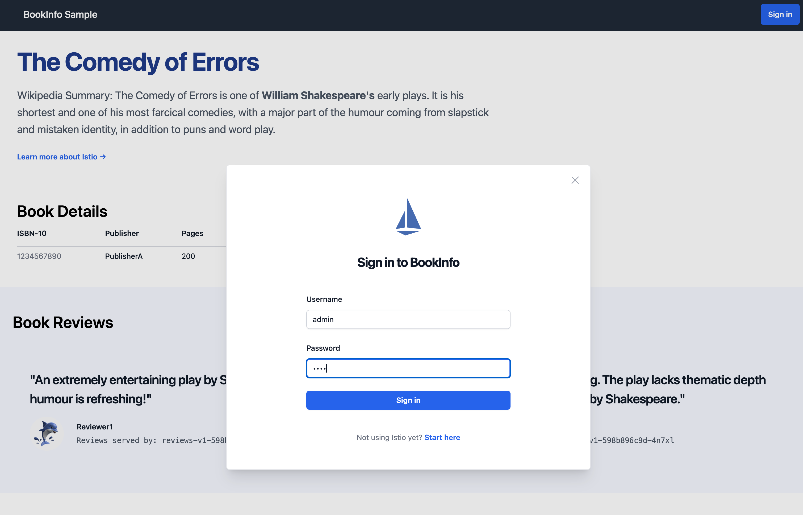
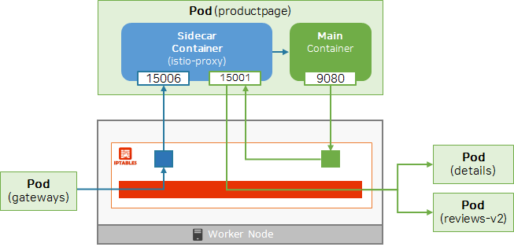
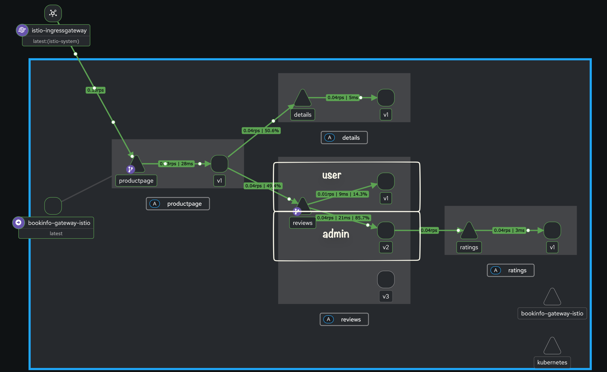
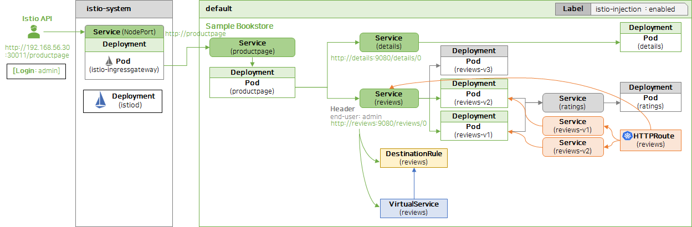

# Request Routing In Istio

> **참고 자료**: [KubeOPS - [아는 만큼 힘이 되는 트래픽 관리]](https://cafe.naver.com/kubeops/822)

---

## 1. 개요 (Overview)

**Request Routing**은 서비스 메시 내에서 트래픽을 정교하게 제어하고 관리하는 핵심 기능입니다.
Istio를 사용하면 다음과 같은 기능을 수행하여 애플리케이션의 가용성과 배포 안정성을 높일 수 있습니다.

- **트래픽 분산**: 특정 서비스 버전으로 트래픽 비중 조절
- **A/B 테스트**: 사용자 그룹별 다른 버전 노출
- **카나리 배포**: 안정성 검증 후 점진적 트래픽 전환

---

## 2. 실습 (Practice)

이전 실습(`01-istio-overview`)에서 배포한 **Bookinfo** 애플리케이션을 기반으로 진행합니다. 이 애플리케이션은 서로 다른 기능을 담당하는 마이크로서비스들로 구성되어 있습니다.

### 2.1. Istio 리소스 적용 (DestinationRule, VirtualService)

트래픽 라우팅 규칙을 정의하기 위해 `DestinationRule`과 `VirtualService`를 생성합니다.

```shell
# 1. Istio 리소스 적용
kubectl apply -f bookstore-app/destination-rule.yaml
kubectl apply -f bookstore-app/virtual-service.yaml

# 2. 적용된 DestinationRule 확인
kubectl get destinationrules reviews -o yaml | kubectl neat
# (출력 예시)
# spec:
#   host: reviews
#   subsets:
#   - labels:
#       version: v1
#     name: v1
#   - labels:
#       version: v2
#     name: v2

# 3. 적용된 VirtualService 확인
kubectl get virtualservices reviews -o yaml | kubectl neat
# (출력 예시)
# spec:
#   hosts:
#   - reviews
#   http:
#   - match:
#     - headers:
#         end-user:
#           exact: admin
#     route:
#     - destination:
#         host: reviews
#         subset: v2
#   - route:
#     - destination:
#         host: reviews
#         subset: v1
```

> **설정 설명**:
>
> - `end-user` 헤더가 `admin`인 경우 → **reviews:v2**로 라우팅
> - 그 외의 경우 → **reviews:v1**으로 라우팅

### 2.2. 라우팅 동작 검증

BookInfo 애플리케이션에 접속하여 설정한 라우팅 규칙이 정상 작동하는지 확인합니다.

```shell
# 노드 정보 확인 (External IP 확인용)
kubectl get no -o wide

# 웹 브라우저로 접속
open http://192.168.205.2:30010/productpage
```

**검증 시나리오**:

1. 우측 상단 `Sign in` 버튼 클릭
2. Username에 `admin` 입력 (Password는 임의 입력 가능)
3. 로그인 후 화면 새로고침 시 **별점(Star Ratings)**이 표시되는지 확인 (`reviews:v2` 특징)



### 2.3. Envoy 액세스 로그 분석

Envoy 프록시의 로그를 활성화하여 트래픽 흐름을 상세히 분석합니다.
> 참고: [Istio Envoy Access Logs 문서](https://istio.io/v1.26/docs/tasks/observability/logs/access-log/#using-mesh-config)

```shell
# 1. Istio 재설치 (Access Log 활성화 설정 포함)
cat <<EOF > istio-cni.yaml
apiVersion: install.istio.io/v1alpha1
kind: IstioOperator
spec:
  components:
    cni:
      namespace: istio-system
      enabled: true
    pilot:
      k8s:
        resources:
          requests:
            cpu: 200m
            memory: 512Mi
  meshConfig:
    accessLogFile: /dev/stdout
    accessLogEncoding: JSON
    accessLogFormat: |
      {
        "req_method": "%REQ(:METHOD)%",
        "req_path": "%REQ(X-ENVOY-ORIGINAL-PATH?:PATH)%",
        "res_code": "%RESPONSE_CODE%",
        "upstream_info": "%UPSTREAM_CLUSTER_RAW%",
        "req_headers_end-user": "%REQ(end-user)%"
      }
EOF

istioctl install -f istio-cni.yaml -y

# 2. 설정 확인
kubectl get cm istio -n istio-system -o yaml

# 3. 트래픽 발생
curl http://192.168.205.2:30010/productpage

# 4. Sidecar(istio-proxy) 로그 확인
kubectl logs deployments/productpage-v1 -c istio-proxy
```

**로그 분석 결과 예시**:

```json
{"req_headers_end-user":"admin","req_method":"GET","req_path":"/details/0","res_code":200,"upstream_info":"outbound|9080||details.default.svc.cluster.local"}
{"req_headers_end-user":"admin","req_method":"GET","req_path":"/reviews/0","res_code":200,"upstream_info":"outbound|9080|v2|reviews.default.svc.cluster.local"}
```



### 2.4. Kiali를 통한 시각화

Kiali 대시보드를 사용하여 서비스 간 트래픽 흐름과 지표를 시각적으로 확인합니다.

```shell
istioctl dashboard kiali
```



#### 2.4.1. 주요 메트릭 설명

| 메트릭 (Metric) | 설명 | 예시 |
| :--- | :--- | :--- |
| **Response Time** | 요청 후 응답까지 걸리는 시간 | `10ms` |
| **Throughput** | 단위 시간당 데이터 전송량 | `4 bps` |
| **Traffic Distribution** | 버전별 트래픽 분산 비율 | `v1: 50%, v2: 50%` |
| **Traffic Rate** | 초당 요청 수 (부하 측정) | `0.01 rps` |

#### 2.4.2. Response Time 상세 지표

| 지표 | 의미 | 설명 |
| :--- | :--- | :--- |
| **Average** | 평균 | 시스템의 일반적인 처리 시간 |
| **Median** | 중앙값 | 사용자가 체감하는 보편적인 응답 시간 |
| **P95** | 95 백분위수 | 하위 95% 요청이 이 시간 이내에 완료됨 (성능 척도) |
| **P99** | 99 백분위수 | 하위 99% 요청이 이 시간 이내에 완료됨 (극단값 제외) |

> **P95 이해하기**: 100개의 요청 중 95번째로 느린 요청의 응답 시간이 `260ms`라면, P95는 `260ms`입니다. 즉, 95%의 사용자는 260ms 이내의 응답 속도를 경험합니다.

### 2.5. Gateway API 활용 (Alternative)

표준화된 **Kubernetes Gateway API**(`HTTPRoute`)를 사용하여 동일한 라우팅을 구현해 봅니다.
기존 Istio API 리소스를 제거하고 Gateway API 리소스를 적용합니다.

```shell
# 1. 기존 Istio 리소스(DestinationRule, VirtualService) 제거
kubectl delete -f https://raw.githubusercontent.com/k8s-1pro/kubernetes-anotherclass-sprint5/refs/heads/main/541-request-routing/5411/istio-api/destination-rule.yaml
kubectl delete -f https://raw.githubusercontent.com/k8s-1pro/kubernetes-anotherclass-sprint5/refs/heads/main/541-request-routing/5411/istio-api/virtual-service.yaml

# 2. Gateway API 리소스(HttpRoute, Service) 적용
kubectl apply -f https://raw.githubusercontent.com/k8s-1pro/kubernetes-anotherclass-sprint5/refs/heads/main/541-request-routing/5411/gateway-api/http-route.yaml
kubectl apply -f https://raw.githubusercontent.com/k8s-1pro/kubernetes-anotherclass-sprint5/refs/heads/main/541-request-routing/5411/gateway-api/service.yaml

# 3. 적용 확인
kubectl get httproutes reviews -o yaml
kubectl get service
```



### 2.6. 리소스 정리

실습이 끝난 후 생성된 리소스를 정리합니다.

```shell
# Gateway API 리소스 삭제
kubectl delete httproutes reviews
kubectl delete service reviews-v1 reviews-v2

# Gateway 삭제
kubectl delete gateways bookinfo-gateway
kubectl delete httproutes bookinfo
```
