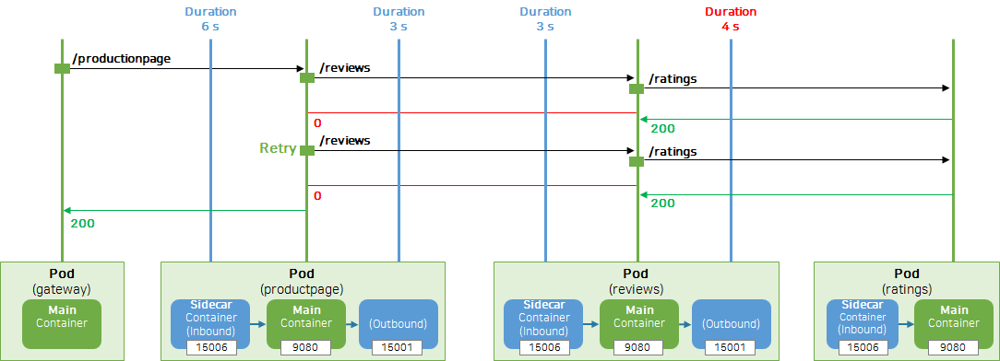
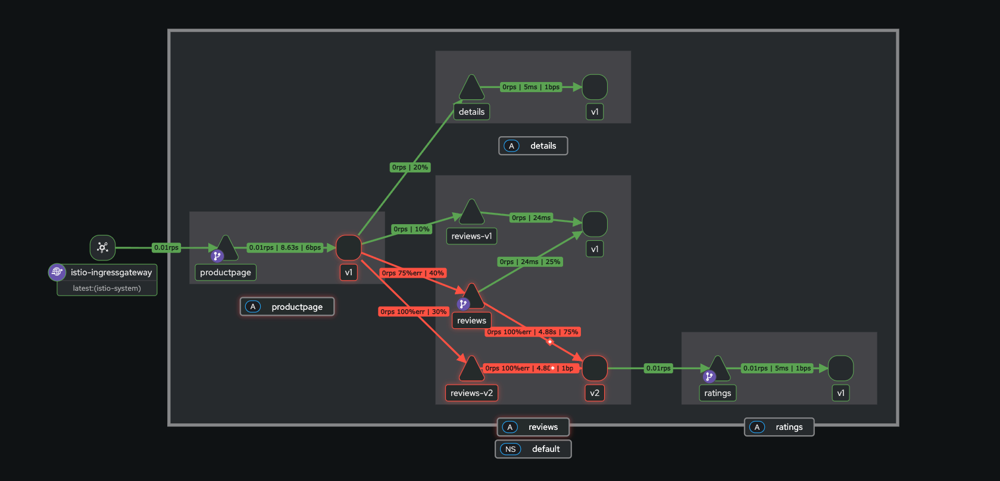
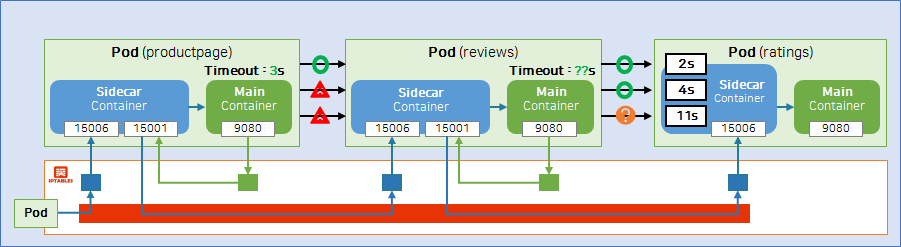
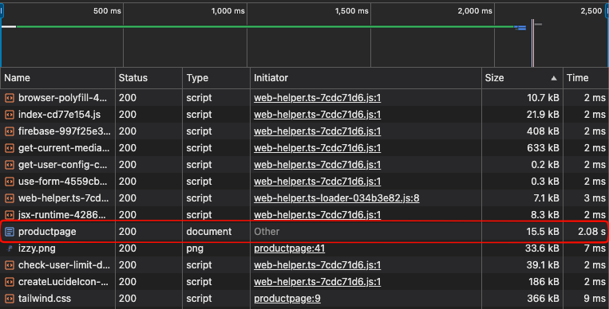
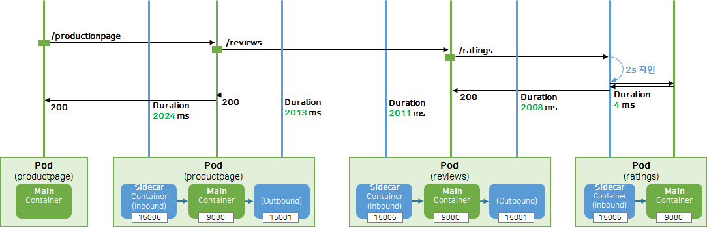
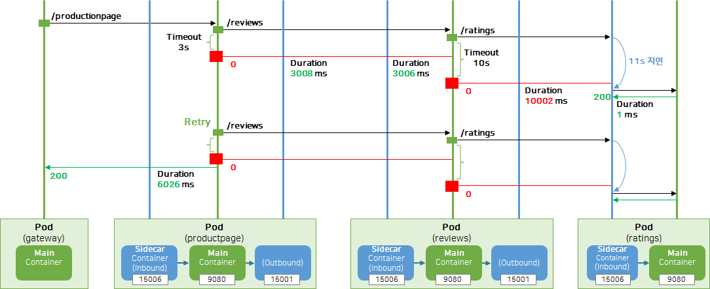
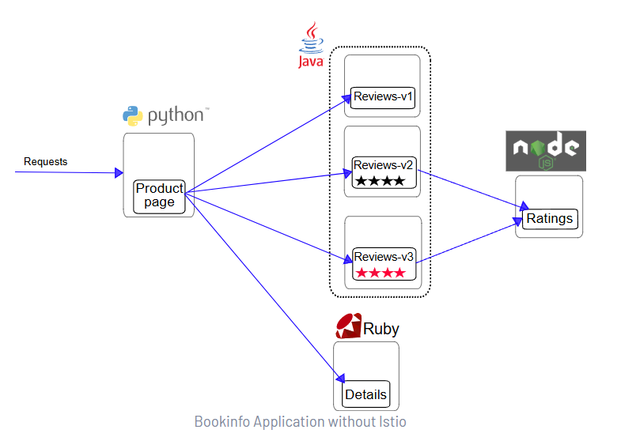
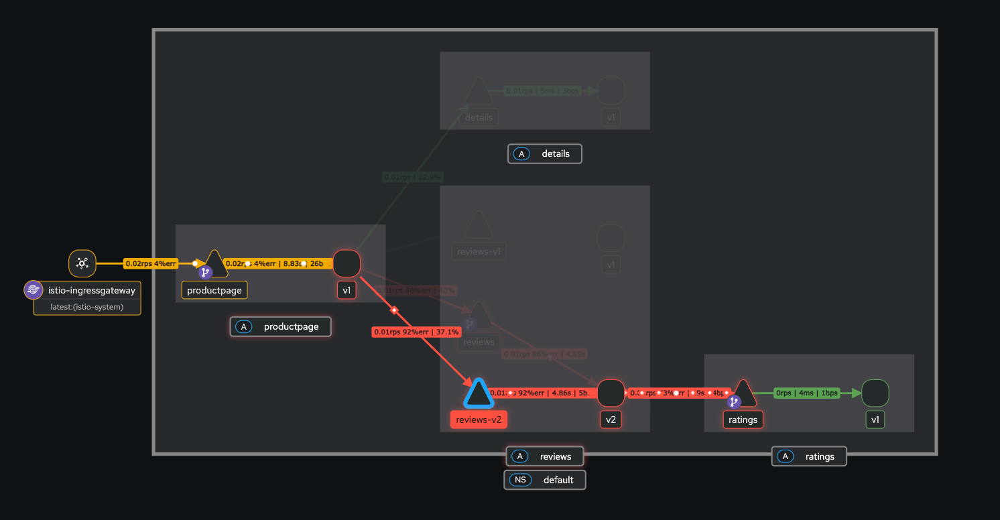
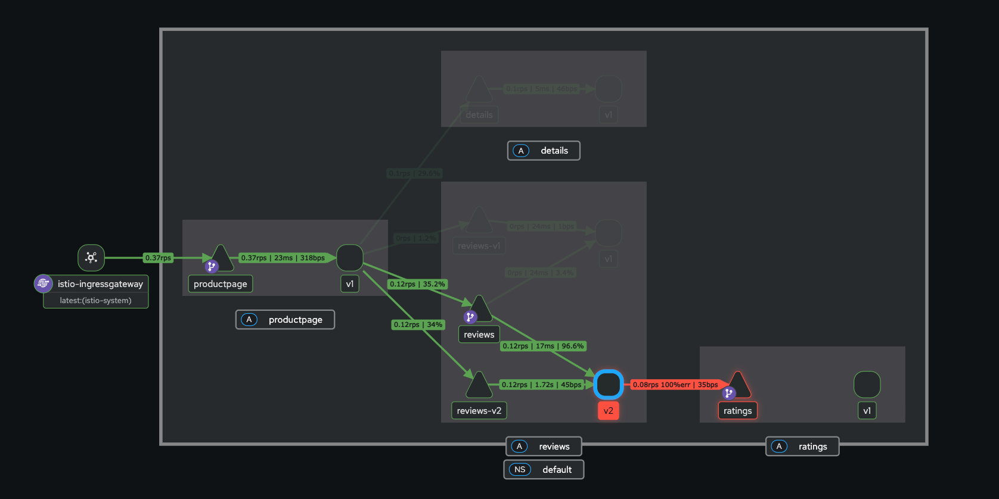

# Istio Fault Injection 실습

## 개요

애플리케이션의 예외 처리 로직은 스테이징 환경에서 검증하기 어렵습니다. 운영 데이터와 연관된 장애는 검증 환경에서 재현이 힘들고, 동일한 장애 상황을 코드로 만드는 것도 번거롭습니다. 이로 인해 운영 환경에서 장애가 발생한 후에야 문제를 발견하고 수정하는 경우가 많습니다.

**Istio의 장애 주입(Fault Injection)** 기능을 사용하면 네트워크 지연이나 오류 응답과 같은 다양한 장애 시나리오를 쉽게 시뮬레이션할 수 있습니다. 이를 통해 애플리케이션의 복원력과 오류 처리 능력을 테스트하고, Retry 로직이나 Timeout 설정이 올바르게 작동하는지 검증할 수 있습니다.

### Fault Injection 유형

| 유형 | 설명 | 사용 사례 |
|------|------|----------|
| **Delay** | 요청에 지연 시간을 추가 | Timeout 설정 검증, 느린 서비스 시뮬레이션 |
| **Abort** | 특정 HTTP 상태 코드로 요청 중단 | 에러 핸들링 로직 검증, 서비스 장애 시뮬레이션 |

### 실습 아키텍처

```
┌─────────────┐     ┌─────────────┐     ┌─────────────┐     ┌─────────────┐
│ Productpage │────▶│   Reviews   │────▶│   Ratings   │◀────│ Fault Inject│
│   (Python)  │     │    (Java)   │     │   (Node.js) │     │ (Delay/Abort)│
│ timeout: 3s │     │ timeout:2.5s│     │             │     └─────────────┘
└─────────────┘     │ (10s black) │     └─────────────┘
       │            └─────────────┘
       ▼
┌─────────────┐
│   Details   │
│    (Ruby)   │
└─────────────┘
```

### 참고 자료

- [Istio Docs - Fault Injection](https://istio.io/latest/docs/tasks/traffic-management/fault-injection/)
- [Istio Docs - HTTPFaultInjection](https://istio.io/latest/docs/reference/config/networking/virtual-service/#HTTPFaultInjection)
- [KubeOPS - Fault Injection](https://cafe.naver.com/kubeops/823)

---

## 목차

1. [사전 세팅 리소스](#1-사전-세팅-리소스-request-routing-실습-내용-포함)
2. [기본 모니터링 (Level-1)](#2-level-1-기본-모니터링)
3. [Envoy 액세스 로그 확인 (Level-2)](#3-level-2-envoy-액세스-로그-확인)
4. [Istio 관리 기능 (Level-3)](#4-level-3-istio-관리-기능)
5. [Delay 테스트 (4s → 2s)](#5-istio-테스트---fault-injection-delay-4s--2s)
6. [Delay 테스트 (2s → 11s)](#6-istio-테스트---fault-injection-delay-2s--11s)
7. [App Timeout 코드 분석](#7-app-timeout-분석)
8. [Abort 테스트](#8-abort-테스트)
9. [리소스 정리](#9-리소스-정리)

---

## 1. 사전 세팅 리소스 (Request Routing 실습 내용 포함)

Fault Injection 실습을 위해 먼저 Request Routing에서 사용한 DestinationRule과 VirtualService를 적용합니다.

```shell
# Istio API - DestinationRule, VirtualService 적용 [Request Routing]
kubectl apply -f https://raw.githubusercontent.com/k8s-1pro/kubernetes-anotherclass-sprint5/refs/heads/main/541-request-routing/5411/istio-api/destination-rule.yaml
kubectl apply -f https://raw.githubusercontent.com/k8s-1pro/kubernetes-anotherclass-sprint5/refs/heads/main/541-request-routing/5411/istio-api/virtual-service.yaml
```

---

## 2. (Level-1) 기본 모니터링

이 단계에서는 Fault Injection을 적용한 후 애플리케이션 로그만으로는 장애 원인을 파악하기 어렵다는 것을 확인합니다.

### 2.1. Ratings 서비스에 Delay Fault Injection 적용

```shell
# Istio API - DestinationRule, VirtualService 적용
kubectl apply -f https://raw.githubusercontent.com/k8s-1pro/kubernetes-anotherclass-sprint5/refs/heads/main/542-fault-injection/5421/istio-api/destination-rule-ratings.yaml
kubectl apply -f https://raw.githubusercontent.com/k8s-1pro/kubernetes-anotherclass-sprint5/refs/heads/main/542-fault-injection/5421/istio-api/virtual-service-ratings-delay.yaml
```

> 💡 위 VirtualService는 `admin` 사용자가 ratings 서비스에 요청할 때 **4초 지연**을 발생시킵니다.

### 2.2. 접속 및 동작 확인

```shell
kubectl get no -o wide
# NAME                   STATUS   ROLES                  AGE     VERSION        INTERNAL-IP    EXTERNAL-IP     OS-IMAGE             KERNEL-VERSION   CONTAINER-RUNTIME
# lima-rancher-desktop   Ready    control-plane,master   4d10h   v1.33.6+k3s1   192.168.5.15   192.168.205.2   Alpine Linux v3.22   6.6.116-0-virt   docker://28.3.3

kubectl get svc -A | rg "30010|30020"
# default        bookinfo-gateway-istio                               LoadBalancer   10.43.63.148    <pending>       15021:30225/TCP,80:30020/TCP                 23h
# istio-system   istio-ingressgateway                                 LoadBalancer   10.43.172.82    192.168.205.2   15021:31354/TCP,80:30010/TCP,443:30372/TCP   25h

# 페이지 테스트
# - 일반 사용자: 지연 없음
# - admin 로그인: 4초 지연 발생 → productpage의 3초 timeout으로 인해 에러 발생
open http://192.168.205.2:30010/productpage
```

> ⚠️ **결과**: admin으로 로그인하면 ratings 서비스에서 별점(★)이 표시되지 않습니다. 이는 productpage의 timeout(3초)보다 지연(4초)이 길기 때문입니다.


### 2.3. Application 로그 확인 (productpage, reviews, ratings)

> ⚠️ **문제점**: 아래와 같이 애플리케이션 로그만으로는 지연이나 오류에 대한 정보를 확인할 수 없습니다.  
> 프로덕션 환경에서는 성능을 위해 로그를 간소화하는 경우가 많아 더욱 파악이 어렵습니다.

```shell
kubectl logs -n default --tail 10 deploy/productpage-v1
# [2025-12-22 14:27:12 +0000] [1] [INFO] Listening at: http://[::]:9080 (1)
# [2025-12-22 14:27:12 +0000] [1] [INFO] Using worker: gevent
# [2025-12-22 14:27:12 +0000] [6] [INFO] Booting worker with pid: 6
# [2025-12-22 14:27:12 +0000] [7] [INFO] Booting worker with pid: 7
# [2025-12-22 14:27:12 +0000] [8] [INFO] Booting worker with pid: 8
# [2025-12-22 14:27:12 +0000] [9] [INFO] Booting worker with pid: 9
# [2025-12-22 14:27:12 +0000] [10] [INFO] Booting worker with pid: 10
# [2025-12-22 14:27:12 +0000] [11] [INFO] Booting worker with pid: 11
# [2025-12-22 14:27:12 +0000] [12] [INFO] Booting worker with pid: 12
# [2025-12-22 14:27:12 +0000] [13] [INFO] Booting worker with pid: 13
kubectl logs -n default --tail 10 deploy/reviews-v2
# WARNING: Unknown module: jdk.management.agent specified to --add-exports
# WARNING: Unknown module: jdk.attach specified to --add-exports
# Launching defaultServer (Open Liberty 24.0.0.12/wlp-1.0.96.cl241220241119-0657) on Eclipse OpenJ9 VM, version 17.0.14+7 (en_US)
# [AUDIT   ] CWWKE0001I: The server defaultServer has been launched.
# [AUDIT   ] CWWKG0093A: Processing configuration drop-ins resource: /opt/ol/wlp/usr/servers/defaultServer/configDropins/defaults/keystore.xml
# [AUDIT   ] CWWKG0093A: Processing configuration drop-ins resource: /opt/ol/wlp/usr/servers/defaultServer/configDropins/defaults/open-default-port.xml
# [AUDIT   ] CWWKT0016I: Web application available (default_host): http://reviews-v2-556d6457d-p2s47:9080/
# [AUDIT   ] CWWKZ0001I: Application reviews-app started in 0.151 seconds.
# [AUDIT   ] CWWKF0012I: The server installed the following features: [jaxrs-2.0, jaxrsClient-2.0, json-1.0, jsonp-1.0, servlet-3.1].
# [AUDIT   ] CWWKF0011I: The defaultServer server is ready to run a smarter planet. The defaultServer server started in 1.146 seconds.
kubectl logs -n default --tail 10 deploy/ratings-v1
# GET /ratings/0
# GET /ratings/0
# GET /ratings/0
# GET /ratings/0
# GET /ratings/0
# GET /ratings/0
# GET /ratings/0
# GET /ratings/0
# GET /ratings/0
# GET /ratings/0
```

---

## 3. (Level-2) Envoy 액세스 로그 확인

Istio를 사용하면 Envoy 사이드카 프록시(istio-proxy)의 로그를 통해 애플리케이션 로그에서 확인할 수 없는 추가 정보를 수집할 수 있습니다.

### 3.1. Sidecar (productpage, reviews, ratings) 로그 확인

> 💡 Envoy 사이드카 프록시의 액세스 로그를 통해 애플리케이션 로그에서 확인할 수 없었던 지연 및 오류 정보를 확인할 수 있습니다.  
> - `res_code: 0`은 upstream 연결 실패 또는 타임아웃을 의미합니다.  
> - `upstream_info` 필드를 통해 어떤 서비스로의 요청에서 문제가 발생했는지 추적할 수 있습니다.


```shell
kubectl logs -n default --tail 10 deploy/productpage-v1 -c istio-proxy 
# {"req_headers_end-user":null,"req_method":"GET","req_path":"/productpage","res_code":200,"upstream_info":"inbound|9080||"}
# {"req_headers_end-user":null,"req_method":"GET","req_path":"/static/img/izzy.png","res_code":304,"upstream_info":"inbound|9080||"}
# {"req_headers_end-user":null,"req_method":"GET","req_path":"/static/tailwind/tailwind.css","res_code":304,"upstream_info":"inbound|9080||"}
# {"req_headers_end-user":null,"req_method":"POST","req_path":"/login","res_code":302,"upstream_info":"inbound|9080||"}
# {"req_headers_end-user":"admin","req_method":"GET","req_path":"/details/0","res_code":200,"upstream_info":"outbound|9080||details.default.svc.cluster.local"} # 정상 응답
# {"req_headers_end-user":"admin","req_method":"GET","req_path":"/reviews/0","res_code":0,"upstream_info":"outbound|9080||reviews-v2.default.svc.cluster.local"} # res_code가 0으로 표시되며 지연 발생
# {"req_headers_end-user":"admin","req_method":"GET","req_path":"/reviews/0","res_code":0,"upstream_info":"outbound|9080||reviews-v2.default.svc.cluster.local"} # res_code가 0으로 표시되며 지연 발생
# {"req_headers_end-user":null,"req_method":"GET","req_path":"/productpage","res_code":200,"upstream_info":"inbound|9080||"}
# {"req_headers_end-user":null,"req_method":"GET","req_path":"/static/tailwind/tailwind.css","res_code":304,"upstream_info":"inbound|9080||"}
# {"req_headers_end-user":null,"req_method":"GET","req_path":"/static/img/izzy.png","res_code":304,"upstream_info":"inbound|9080||"}
kubectl logs -n default --tail 10 deploy/reviews-v2 -c istio-proxy 
# 2025-12-23T11:31:33.662538Z     info    xdsproxy        connected to delta upstream XDS server: istiod.istio-system.svc:15012   id=27
# 2025-12-23T11:45:34.505178Z     info    cache   generated new workload certificate      resourceName=default latency=32.590625ms ttl=23h59m59.49482421s
# 2025-12-23T12:00:02.640147Z     info    xdsproxy        connected to delta upstream XDS server: istiod.istio-system.svc:15012   id=28
# 2025-12-23T12:32:44.121256Z     info    xdsproxy        connected to delta upstream XDS server: istiod.istio-system.svc:15012   id=29
# 2025-12-23T13:05:53.499030Z     info    xdsproxy        connected to delta upstream XDS server: istiod.istio-system.svc:15012   id=30
# 2025-12-23T13:34:20.186738Z     info    xdsproxy        connected to delta upstream XDS server: istiod.istio-system.svc:15012   id=31
# {"req_headers_end-user":"admin","req_method":"GET","req_path":"/reviews/0","res_code":0,"upstream_info":"inbound|9080||"} # res_code가 0으로 표시되며 지연 발생
# {"req_headers_end-user":"admin","req_method":"GET","req_path":"/ratings/0","res_code":200,"upstream_info":"outbound|9080|v1|ratings.default.svc.cluster.local"}
# {"req_headers_end-user":"admin","req_method":"GET","req_path":"/reviews/0","res_code":0,"upstream_info":"inbound|9080||"} # res_code가 0으로 표시되며 지연 발생
# {"req_headers_end-user":"admin","req_method":"GET","req_path":"/ratings/0","res_code":200,"upstream_info":"outbound|9080|v1|ratings.default.svc.cluster.local"}
kubectl logs -n default --tail 10 deploy/ratings-v1 -c istio-proxy 
# 2025-12-23T10:45:29.543473Z     info    xdsproxy        connected to delta upstream XDS server: istiod.istio-system.svc:15012   id=25
# 2025-12-23T11:12:50.261825Z     info    xdsproxy        connected to delta upstream XDS server: istiod.istio-system.svc:15012   id=26
# 2025-12-23T11:43:52.694846Z     info    xdsproxy        connected to delta upstream XDS server: istiod.istio-system.svc:15012   id=27
# 2025-12-23T11:45:40.472597Z     info    cache   generated new workload certificate      resourceName=default latency=73.120917ms ttl=23h59m59.527404415s
# 2025-12-23T12:13:34.145041Z     info    xdsproxy        connected to delta upstream XDS server: istiod.istio-system.svc:15012   id=28
# 2025-12-23T12:41:54.467912Z     info    xdsproxy        connected to delta upstream XDS server: istiod.istio-system.svc:15012   id=29
# 2025-12-23T13:15:02.881592Z     info    xdsproxy        connected to delta upstream XDS server: istiod.istio-system.svc:15012   id=30
# {"req_headers_end-user":"admin","req_method":"GET","req_path":"/ratings/0","res_code":200,"upstream_info":"inbound|9080||"}
# {"req_headers_end-user":"admin","req_method":"GET","req_path":"/ratings/0","res_code":200,"upstream_info":"inbound|9080||"}
# 2025-12-23T13:47:09.092434Z     info    xdsproxy        connected to delta upstream XDS server: istiod.istio-system.svc:15012   id=31
```

---

## 4. (Level-3) Istio 관리 기능

기본 Envoy 로그에는 요청 소요 시간(duration)이 포함되지 않습니다. Istio 설정을 통해 액세스 로그 포맷을 커스터마이징하여 더 상세한 디버깅 정보를 확인할 수 있습니다.

### 4.1. Envoy 로그 설정 (Duration 필드 추가)

- [Istio Docs - Envoy Access Logs](https://istio.io/v1.26/docs/tasks/observability/logs/access-log/#default-access-log-format)

아래 설정은 `%DURATION%` 필드를 추가하여 각 요청의 소요 시간(밀리초)을 확인할 수 있도록 합니다.

```shell
# Istio 설치 (Istio-cni 방식)
cat <<EOF > istio-cni.yaml
apiVersion: install.istio.io/v1alpha1
kind: IstioOperator
spec:
  components:
    cni:
      namespace: istio-system
      enabled: true
    pilot:
      k8s:
        resources:
          requests:
            cpu: 200m
            memory: 512Mi
  meshConfig:
    accessLogFile: /dev/stdout
    accessLogEncoding: JSON
    accessLogFormat: |
      {
        "duration": "%DURATION%",
        "req_method": "%REQ(:METHOD)%",
        "req_path": "%REQ(X-ENVOY-ORIGINAL-PATH?:PATH)%",
        "res_code": "%RESPONSE_CODE%",
        "upstream_info": "%UPSTREAM_CLUSTER_RAW%",
        "req_headers_end-user": "%REQ(end-user)%"
      }
EOF
istioctl install -f istio-cni.yaml -y

# 설정 확인
kubectl get cm istio -n istio-system -o yaml | kubectl neat
# apiVersion: v1
# data:
#   mesh: |-
#     accessLogEncoding: JSON
#     accessLogFile: /dev/stdout
#     accessLogFormat: |
#       {
#         "duration": "%DURATION%",
#         "req_method": "%REQ(:METHOD)%",
#         "req_path": "%REQ(X-ENVOY-ORIGINAL-PATH?:PATH)%",
#         "res_code": "%RESPONSE_CODE%",
#         "upstream_info": "%UPSTREAM_CLUSTER_RAW%",
#         "req_headers_end-user": "%REQ(end-user)%"
#       }
#     defaultConfig:
#       discoveryAddress: istiod.istio-system.svc:15012
#     defaultProviders:
#       metrics:
#       - prometheus
#     enablePrometheusMerge: true
#     rootNamespace: istio-system
#     trustDomain: cluster.local
#   meshNetworks: 'networks: {}'
# kind: ConfigMap
# metadata:
#   labels:
#     app.kubernetes.io/instance: istio
#     app.kubernetes.io/managed-by: Helm
#     app.kubernetes.io/name: istiod
#     app.kubernetes.io/part-of: istio
#     app.kubernetes.io/version: 1.0.0
#     helm.sh/chart: istiod-1.0.0
#     install.operator.istio.io/owning-resource: unknown
#     install.operator.istio.io/owning-resource-namespace: istio-system
#     istio.io/rev: default
#     operator.istio.io/component: Pilot
#     operator.istio.io/managed: Reconcile
#     operator.istio.io/version: 1.28.2
#     release: istio
#   name: istio
#   namespace: istio-system
```

### 4.2. Productpage, Reviews 로그 조회

```shell
# 대시보드 트래픽 발생 (admin 사용자 로그인)
open http://192.168.205.2:30010/productpage

# 로그 확인  (res_code 0 및 duration 필드 확인)
kubectl logs -n default --tail 10 deploy/productpage-v1 -c istio-proxy
# {"duration":6,"req_headers_end-user":null,"req_method":"POST","req_path":"/login","res_code":302,"upstream_info":"inbound|9080||"}
# {"duration":4,"req_headers_end-user":"admin","req_method":"GET","req_path":"/details/0","res_code":200,"upstream_info":"outbound|9080||details.default.svc.cluster.local"}
# {"duration":3001,"req_headers_end-user":"admin","req_method":"GET","req_path":"/reviews/0","res_code":0,"upstream_info":"outbound|9080||reviews-v2.default.svc.cluster.local"}
# {"duration":3002,"req_headers_end-user":"admin","req_method":"GET","req_path":"/reviews/0","res_code":0,"upstream_info":"outbound|9080||reviews-v2.default.svc.cluster.local"}
# {"duration":3001,"req_headers_end-user":"admin","req_method":"GET","req_path":"/reviews/0","res_code":0,"upstream_info":"outbound|9080||reviews-v2.default.svc.cluster.local"}
# {"duration":3001,"req_headers_end-user":"admin","req_method":"GET","req_path":"/reviews/0","res_code":0,"upstream_info":"outbound|9080||reviews-v2.default.svc.cluster.local"}
# {"duration":6017,"req_headers_end-user":null,"req_method":"GET","req_path":"/productpage","res_code":200,"upstream_info":"inbound|9080||"}
# {"duration":2,"req_headers_end-user":null,"req_method":"GET","req_path":"/static/tailwind/tailwind.css","res_code":304,"upstream_info":"inbound|9080||"}
# {"duration":1,"req_headers_end-user":"admin","req_method":"GET","req_path":"/details/0","res_code":200,"upstream_info":"outbound|9080||details.default.svc.cluster.local"}
# {"duration":8,"req_headers_end-user":null,"req_method":"GET","req_path":"/static/img/izzy.png","res_code":304,"upstream_info":"inbound|9080||"}
kubectl logs -n default --tail 10 deploy/reviews-v2 -c istio-proxy
# {"duration":2999,"req_headers_end-user":"admin","req_method":"GET","req_path":"/reviews/0","res_code":0,"upstream_info":"inbound|9080||"}
# {"duration":4005,"req_headers_end-user":"admin","req_method":"GET","req_path":"/ratings/0","res_code":200,"upstream_info":"outbound|9080|v1|ratings.default.svc.cluster.local"}
# {"duration":3001,"req_headers_end-user":"admin","req_method":"GET","req_path":"/reviews/0","res_code":0,"upstream_info":"inbound|9080||"}
# {"duration":4003,"req_headers_end-user":"admin","req_method":"GET","req_path":"/ratings/0","res_code":200,"upstream_info":"outbound|9080|v1|ratings.default.svc.cluster.local"}
# {"duration":3000,"req_headers_end-user":"admin","req_method":"GET","req_path":"/reviews/0","res_code":0,"upstream_info":"inbound|9080||"}
# {"duration":4000,"req_headers_end-user":"admin","req_method":"GET","req_path":"/ratings/0","res_code":200,"upstream_info":"outbound|9080|v1|ratings.default.svc.cluster.local"}
# {"duration":3001,"req_headers_end-user":"admin","req_method":"GET","req_path":"/reviews/0","res_code":0,"upstream_info":"inbound|9080||"}
# {"duration":3996,"req_headers_end-user":"admin","req_method":"GET","req_path":"/ratings/0","res_code":200,"upstream_info":"outbound|9080|v1|ratings.default.svc.cluster.local"}
# {"duration":3002,"req_headers_end-user":"admin","req_method":"GET","req_path":"/reviews/0","res_code":0,"upstream_info":"inbound|9080||"}
# {"duration":3997,"req_headers_end-user":"admin","req_method":"GET","req_path":"/ratings/0","res_code":200,"upstream_info":"outbound|9080|v1|ratings.default.svc.cluster.local"}
```



### 4.3. Kiali 대시보드 확인
```
istioctl dashboard kiali
```



## 5. Istio 테스트 - Fault Injection (Delay: 4s → 2s)

Reviews 서비스의 timeout은 2.5초(일반 사용자) 또는 10초(black star)입니다. Delay를 4초에서 2초로 변경하면 timeout 내에 응답을 받을 수 있습니다.



### 5.1. VirtualService 수정

```shell
# Istio API - VirtualService 수정 (fixed delay 4s -> 2s)
kubectl edit virtualservice ratings-delay

# 대시보드 재접속 후 DevTools로 지연시간 확인
open http://192.168.205.2:30010/productpage
```

> ✅ **결과**: Delay가 2초로 변경되어 reviews의 timeout(2.5초) 내에 응답을 받을 수 있게 됩니다. 별점(★)이 정상적으로 표시됩니다.



### 5.2. Sidecar (Productpage, Reviews, Ratings) 로그 확인

```shell
kubectl logs -n default --tail 10 deploy/productpage-v1 -c istio-proxy
# {"duration":2024,"req_headers_end-user":null,"req_method":"GET","req_path":"/productpage","res_code":200,"upstream_info":"inbound|9080||"}
# {"duration":2013,"req_headers_end-user":"admin","req_method":"GET","req_path":"/reviews/0","res_code":200,"upstream_info":"outbound|9080|v2|reviews.default.svc.cluster.local"}

kubectl logs -n default --tail 10 deploy/reviews-v2 -c istio-proxy # 2초
# {"duration":2011,"req_headers_end-user":"admin","req_method":"GET","req_path":"/reviews/0","res_code":200,"upstream_info":"inbound|9080||"}
# {"duration":2008,"req_headers_end-user":"admin","req_method":"GET","req_path":"/ratings/0","res_code":200,"upstream_info":"outbound|9080|v1|ratings.default.svc.cluster.local"}

kubectl logs -n default --tail 10 deploy/ratings-v1 -c istio-proxy
# {"duration":4,"req_headers_end-user":"admin","req_method":"GET","req_path":"/ratings/0","res_code":200,"upstream_info":"inbound|9080||"}
```



---

## 6. Istio 테스트 - Fault Injection (Delay: 2s → 11s)

Delay를 11초로 설정하면 Reviews의 timeout(2.5초/10초)을 초과하게 됩니다. 이 경우 Productpage는 Reviews 서비스를 호출할 때 재시도(Retry)를 수행합니다.

### 6.1. VirtualService 수정

```shell
# Istio API - VirtualService 수정 (fixed delay 2s -> 11s)
kubectl edit virtualservice ratings-delay

# 대시보드 재접속 후 DevTools로 지연시간 확인
# 예상: 11초 지연이지만 실제로는 6초 (3초 timeout x 2회 재시도)
open http://192.168.205.2:30010/productpage
```

> 💡 **분석**: productpage는 reviews 서비스 호출 시 3초 timeout을 적용하고, timeout 발생 시 1회 재시도합니다.  
> 따라서 총 소요 시간은 약 6초(3초 × 2).

### 6.2. Sidecar (Productpage, Reviews, Ratings) 로그 확인

```shell
kubectl logs -n default --tail 10 deploy/productpage-v1 -c istio-proxy
# {"duration":6026,"req_headers_end-user":null,"req_method":"GET","req_path":"/productpage","res_code":200,"upstream_info":"inbound|9080||"}
# {"duration":3008,"req_headers_end-user":"admin","req_method":"GET","req_path":"/reviews/0","res_code":0,"upstream_info":"outbound|9080|v2|reviews.default.svc.cluster.local"}
# // Retry
# {"duration":3001,"req_headers_end-user":"admin","req_method":"GET","req_path":"/reviews/0","res_code":0,"upstream_info":"outbound|9080|v2|reviews.default.svc.cluster.local"}

kubectl logs -n default --tail 10 deploy/reviews-v2 -c istio-proxy
# {"duration":3006,"req_headers_end-user":"admin","req_method":"GET","req_path":"/reviews/0","res_code":0,"upstream_info":"inbound|9080||"}
# {"duration":10002,"req_headers_end-user":"admin","req_method":"GET","req_path":"/ratings/0","res_code":0,"upstream_info":"outbound|9080|v1|ratings.default.svc.cluster.local"}
# // Retry
# {"duration":2999,"req_headers_end-user":"admin","req_method":"GET","req_path":"/reviews/0","res_code":0,"upstream_info":"inbound|9080||"}
# {"duration":10002,"req_headers_end-user":"admin","req_method":"GET","req_path":"/ratings/0","res_code":0,"upstream_info":"outbound|9080|v1|ratings.default.svc.cluster.local"}

kubectl logs -n default --tail 10 deploy/ratings-v1 -c istio-proxy
# {"duration":1,"req_headers_end-user":"admin","req_method":"GET","req_path":"/ratings/0","res_code":200,"upstream_info":"inbound|9080||"}
# // Retry
# {"duration":1,"req_headers_end-user":"admin","req_method":"GET","req_path":"/ratings/0","res_code":200,"upstream_info":"inbound|9080||"}
```



---

## 7. App Timeout 분석

각 서비스별로 설정된 Timeout 값을 코드에서 확인해봅니다. Fault Injection 테스트 시 이 Timeout 값을 고려하여 적절한 지연 시간을 설정해야 합니다.



### 서비스별 Timeout 설정

| 서비스 | 언어 | Timeout 설정 |
|--------|------|-------------|
| **Productpage** | Python | 3.0초 (`timeout=3.0`) |
| **Reviews** | Java | 일반: 2.5초 / Black star: 10초 |
| **Ratings** | Node.js | 7초 (서버 응답 지연 시뮬레이션) |

### 소스 코드 참고 링크

- **Productpage (Python)**: [productpage.py](https://github.com/istio/istio/blob/master/samples/bookinfo/src/productpage/productpage.py)
  ```python
  res = send_request(url, headers=headers, timeout=3.0)
  ```
- **Reviews (Java)**: [LibertyRestEndpoint.java](https://github.com/istio/istio/blob/master/samples/bookinfo/src/reviews/reviews-application/src/main/java/application/rest/LibertyRestEndpoint.java)
  ```java
  timeout = star_color.equals("black") ? 10000 : 2500
  ```
- **Ratings (Node.js)**: [ratings.js](https://github.com/istio/istio/blob/master/samples/bookinfo/src/ratings/ratings.js)
  ```javascript
  setTimeout(getLocalReviewsSuccessful, 7000, res, productId)
  ```

### Kiali 대시보드 확인

```shell
istioctl dashboard kiali
```



---

## 8. Abort 테스트

Delay와 달리 **Abort**는 특정 HTTP 상태 코드로 요청을 즉시 실패시킵니다. 이를 통해 서비스 장애 상황에서 애플리케이션의 에러 핸들링 로직을 검증할 수 있습니다.

### 8.1. Abort VirtualService 적용

```shell
# VirtualService - Delay 삭제
kubectl delete virtualservice -n default ratings-delay

# VirtualService - Abort 생성
kubectl apply -f https://raw.githubusercontent.com/k8s-1pro/kubernetes-anotherclass-sprint5/refs/heads/main/542-fault-injection/5421/istio-api/virtual-service-ratings-abort.yaml

# Abort 설정 내용 확인
kubectl get virtualservice -n default ratings-abort -o yaml | kubectl neat
```

### 8.2. Abort VirtualService 설명

아래 VirtualService는 `admin` 사용자가 ratings 서비스에 요청할 때 **100% 확률로 HTTP 500 에러**를 반환하도록 설정합니다. `fault.abort` 필드를 통해 실제 서비스 장애 없이 에러 응답을 시뮬레이션할 수 있으며, 이를 통해 애플리케이션의 에러 핸들링 로직을 검증할 수 있습니다.

```yaml
apiVersion: networking.istio.io/v1
kind: VirtualService
metadata:
  name: ratings-abort
  namespace: default
spec:
  hosts:
  - ratings
  http:
  - fault:
      abort:
        httpStatus: 500
        percentage:
          value: 100
    match:
    - headers:
        end-user:
          exact: admin
    route:
    - destination:
        host: ratings
        subset: v1
  - route:
    - destination:
        host: ratings
        subset: v1
```

### 8.3. 대시보드 접속 및 결과 확인

```shell
# admin으로 로그인 (비밀번호는 아무거나)
open http://192.168.205.2:30010/productpage
```

> ⚠️ **결과**: admin으로 로그인하면 ratings 서비스가 HTTP 500 에러를 반환하므로 별점(★) 대신 에러 메시지가 표시됩니다.



---

## 9. 리소스 정리

실습이 완료되면 생성한 Istio 리소스를 정리합니다.

```shell
# Istio API - VirtualService, DestinationRule 삭제
kubectl delete virtualservice -n default ratings-abort reviews
kubectl delete destinationrule -n default ratings reviews
```

---

## 정리

### 핵심 학습 내용

1. **Fault Injection 유형**
   - **Delay**: 요청에 지연 시간을 추가하여 Timeout 로직 검증
   - **Abort**: 특정 HTTP 상태 코드로 요청 실패 시뮬레이션

2. **모니터링 레벨**
   - **Level-1**: 애플리케이션 로그 (제한적인 정보)
   - **Level-2**: Envoy 사이드카 로그 (`res_code`, `upstream_info`)
   - **Level-3**: Istio 커스텀 로그 포맷 (`duration` 필드 추가)

3. **Timeout과 Retry 동작 이해**
   - 각 서비스별 Timeout 설정 확인의 중요성
   - Timeout 초과 시 자동 Retry 동작 분석

### 트러블슈팅 팁

| 증상 | 확인 방법 | 해결책 |
|------|----------|--------|
| `res_code: 0` | Envoy 로그 확인 | Timeout 설정 조정 |
| 예상보다 긴 응답 시간 | `duration` 필드 확인 | Retry 횟수 확인 |
| HTTP 500 에러 | Abort 설정 확인 | VirtualService 수정/삭제 |