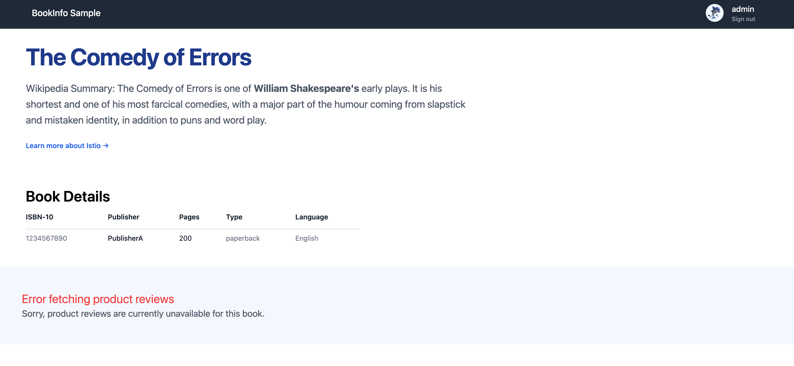

# Istio Fault Injection

애플리케이션의 예외 처리 로직은 스테이징 환경에서 검증하기 어렵습니다. 운영 데이터와 연관된 장애는 검증 환경에서 재현이 힘들고, 동일한 장애 상황을 코드로 만드는 것도 번거롭습니다. 이로 인해 운영 환경에서 장애가 발생한 후에야 문제를 발견하고 수정하는 경우가 많습니다.

Istio의 장애 주입(Fault Injection) 기능을 사용하면 네트워크 지연이나 오류 응답과 같은 다양한 장애 시나리오를 쉽게 시뮬레이션할 수 있습니다. 이를 통해 애플리케이션의 복원력과 오류 처리 능력을 테스트하고, Retry 로직이나 Timeout 설정이 올바르게 작동하는지 검증할 수 있습니다.

애플리케이션 로그는 프로덕션 환경에서 성능 향상을 위해 간소화하는 경우가 많습니다. Istio를 사용하면 Envoy 프록시(istio-proxy) 로그를 통해 추가적인 정보를 수집할 수 있어, 장애 상황에서 문제를 더 쉽게 진단할 수 있습니다.

- [Istio Docs - Istio Fault Injection](https://istio.io/latest/docs/tasks/traffic-management/fault-injection/)
- [Istio Docs - HTTPFaultInjection](https://istio.io/latest/docs/reference/config/networking/virtual-service/#HTTPFaultInjection)

---

## 1. 사전 세팅 리소스 (Request Routing 실습 내용 포함)

```shell
# Istio API - DestinationRule, VirtualService 적용 [Request Routing]
kubectl apply -f https://raw.githubusercontent.com/k8s-1pro/kubernetes-anotherclass-sprint5/refs/heads/main/541-request-routing/5411/istio-api/destination-rule.yaml
kubectl apply -f https://raw.githubusercontent.com/k8s-1pro/kubernetes-anotherclass-sprint5/refs/heads/main/541-request-routing/5411/istio-api/virtual-service.yaml
```

---

## 2. (Level-1) 기본 모니터링

### 2.1. rating 서비스에 작업 지연 상황 적용

```shell
# Istio API - DestinationRule, VirtualService 적용
kubectl apply -f https://raw.githubusercontent.com/k8s-1pro/kubernetes-anotherclass-sprint5/refs/heads/main/542-fault-injection/5421/istio-api/destination-rule-ratings.yaml
kubectl apply -f https://raw.githubusercontent.com/k8s-1pro/kubernetes-anotherclass-sprint5/refs/heads/main/542-fault-injection/5421/istio-api/virtual-service-ratings-delay.yaml
```

### 2.2. 접속 및 동작 확인

```shell
kubectl get no -o wide
# NAME                   STATUS   ROLES                  AGE     VERSION        INTERNAL-IP    EXTERNAL-IP     OS-IMAGE             KERNEL-VERSION   CONTAINER-RUNTIME
# lima-rancher-desktop   Ready    control-plane,master   4d10h   v1.33.6+k3s1   192.168.5.15   192.168.205.2   Alpine Linux v3.22   6.6.116-0-virt   docker://28.3.3

kubectl get svc -A | rg "30010|30020"
# default        bookinfo-gateway-istio                               LoadBalancer   10.43.63.148    <pending>       15021:30225/TCP,80:30020/TCP                 23h
# istio-system   istio-ingressgateway                                 LoadBalancer   10.43.172.82    192.168.205.2   15021:31354/TCP,80:30010/TCP,443:30372/TCP   25h

# 페이지 테스트 (일반 사용자는 지연이 없지만 admin으로 로그인하면 지연이 생김())
open http://192.168.205.2:30010/productpage
```



### 2.3. Application 로그 확인 (productpage, reviews, ratings)

> 아래와 같이 앱 로그로 지연이나 오류에 대한 정보를 확인할 수 없는 경우가 있습니다.

```shell
kubectl logs -n default --tail 10 deploy/productpage-v1
# [2025-12-22 14:27:12 +0000] [1] [INFO] Listening at: http://[::]:9080 (1)
# [2025-12-22 14:27:12 +0000] [1] [INFO] Using worker: gevent
# [2025-12-22 14:27:12 +0000] [6] [INFO] Booting worker with pid: 6
# [2025-12-22 14:27:12 +0000] [7] [INFO] Booting worker with pid: 7
# [2025-12-22 14:27:12 +0000] [8] [INFO] Booting worker with pid: 8
# [2025-12-22 14:27:12 +0000] [9] [INFO] Booting worker with pid: 9
# [2025-12-22 14:27:12 +0000] [10] [INFO] Booting worker with pid: 10
# [2025-12-22 14:27:12 +0000] [11] [INFO] Booting worker with pid: 11
# [2025-12-22 14:27:12 +0000] [12] [INFO] Booting worker with pid: 12
# [2025-12-22 14:27:12 +0000] [13] [INFO] Booting worker with pid: 13
kubectl logs -n default --tail 10 deploy/reviews-v2
# WARNING: Unknown module: jdk.management.agent specified to --add-exports
# WARNING: Unknown module: jdk.attach specified to --add-exports
# Launching defaultServer (Open Liberty 24.0.0.12/wlp-1.0.96.cl241220241119-0657) on Eclipse OpenJ9 VM, version 17.0.14+7 (en_US)
# [AUDIT   ] CWWKE0001I: The server defaultServer has been launched.
# [AUDIT   ] CWWKG0093A: Processing configuration drop-ins resource: /opt/ol/wlp/usr/servers/defaultServer/configDropins/defaults/keystore.xml
# [AUDIT   ] CWWKG0093A: Processing configuration drop-ins resource: /opt/ol/wlp/usr/servers/defaultServer/configDropins/defaults/open-default-port.xml
# [AUDIT   ] CWWKT0016I: Web application available (default_host): http://reviews-v2-556d6457d-p2s47:9080/
# [AUDIT   ] CWWKZ0001I: Application reviews-app started in 0.151 seconds.
# [AUDIT   ] CWWKF0012I: The server installed the following features: [jaxrs-2.0, jaxrsClient-2.0, json-1.0, jsonp-1.0, servlet-3.1].
# [AUDIT   ] CWWKF0011I: The defaultServer server is ready to run a smarter planet. The defaultServer server started in 1.146 seconds.
kubectl logs -n default --tail 10 deploy/ratings-v1
# GET /ratings/0
# GET /ratings/0
# GET /ratings/0
# GET /ratings/0
# GET /ratings/0
# GET /ratings/0
# GET /ratings/0
# GET /ratings/0
# GET /ratings/0
# GET /ratings/0
```

---

## 3. (Level-2) Envoy 액세스 로그 확인

### 3.1. Sidecar(productpage, reviews, ratings) 로그 확인

> Envoy 사이드카 프록시의 액세스 로그를 통해 애플리케이션 로그에서 확인할 수 없었던 지연 및 오류 정보를 확인할 수 있습니다. `res_code: 0`은 upstream 연결 실패 또는 타임아웃을 의미하며, `upstream_info` 필드를 통해 어떤 서비스로의 요청에서 문제가 발생했는지 추적할 수 있습니다.


```shell
kubectl logs -n default --tail 10 deploy/productpage-v1 -c istio-proxy 
# {"req_headers_end-user":null,"req_method":"GET","req_path":"/productpage","res_code":200,"upstream_info":"inbound|9080||"}
# {"req_headers_end-user":null,"req_method":"GET","req_path":"/static/img/izzy.png","res_code":304,"upstream_info":"inbound|9080||"}
# {"req_headers_end-user":null,"req_method":"GET","req_path":"/static/tailwind/tailwind.css","res_code":304,"upstream_info":"inbound|9080||"}
# {"req_headers_end-user":null,"req_method":"POST","req_path":"/login","res_code":302,"upstream_info":"inbound|9080||"}
# {"req_headers_end-user":"admin","req_method":"GET","req_path":"/details/0","res_code":200,"upstream_info":"outbound|9080||details.default.svc.cluster.local"} # 정상 응답
# {"req_headers_end-user":"admin","req_method":"GET","req_path":"/reviews/0","res_code":0,"upstream_info":"outbound|9080||reviews-v2.default.svc.cluster.local"} # res_code가 0으로 표시되며 지연 발생
# {"req_headers_end-user":"admin","req_method":"GET","req_path":"/reviews/0","res_code":0,"upstream_info":"outbound|9080||reviews-v2.default.svc.cluster.local"} # res_code가 0으로 표시되며 지연 발생
# {"req_headers_end-user":null,"req_method":"GET","req_path":"/productpage","res_code":200,"upstream_info":"inbound|9080||"}
# {"req_headers_end-user":null,"req_method":"GET","req_path":"/static/tailwind/tailwind.css","res_code":304,"upstream_info":"inbound|9080||"}
# {"req_headers_end-user":null,"req_method":"GET","req_path":"/static/img/izzy.png","res_code":304,"upstream_info":"inbound|9080||"}
kubectl logs -n default --tail 10 deploy/reviews-v2 -c istio-proxy 
# 2025-12-23T11:31:33.662538Z     info    xdsproxy        connected to delta upstream XDS server: istiod.istio-system.svc:15012   id=27
# 2025-12-23T11:45:34.505178Z     info    cache   generated new workload certificate      resourceName=default latency=32.590625ms ttl=23h59m59.49482421s
# 2025-12-23T12:00:02.640147Z     info    xdsproxy        connected to delta upstream XDS server: istiod.istio-system.svc:15012   id=28
# 2025-12-23T12:32:44.121256Z     info    xdsproxy        connected to delta upstream XDS server: istiod.istio-system.svc:15012   id=29
# 2025-12-23T13:05:53.499030Z     info    xdsproxy        connected to delta upstream XDS server: istiod.istio-system.svc:15012   id=30
# 2025-12-23T13:34:20.186738Z     info    xdsproxy        connected to delta upstream XDS server: istiod.istio-system.svc:15012   id=31
# {"req_headers_end-user":"admin","req_method":"GET","req_path":"/reviews/0","res_code":0,"upstream_info":"inbound|9080||"} # res_code가 0으로 표시되며 지연 발생
# {"req_headers_end-user":"admin","req_method":"GET","req_path":"/ratings/0","res_code":200,"upstream_info":"outbound|9080|v1|ratings.default.svc.cluster.local"}
# {"req_headers_end-user":"admin","req_method":"GET","req_path":"/reviews/0","res_code":0,"upstream_info":"inbound|9080||"} # res_code가 0으로 표시되며 지연 발생
# {"req_headers_end-user":"admin","req_method":"GET","req_path":"/ratings/0","res_code":200,"upstream_info":"outbound|9080|v1|ratings.default.svc.cluster.local"}
kubectl logs -n default --tail 10 deploy/ratings-v1 -c istio-proxy 
# 2025-12-23T10:45:29.543473Z     info    xdsproxy        connected to delta upstream XDS server: istiod.istio-system.svc:15012   id=25
# 2025-12-23T11:12:50.261825Z     info    xdsproxy        connected to delta upstream XDS server: istiod.istio-system.svc:15012   id=26
# 2025-12-23T11:43:52.694846Z     info    xdsproxy        connected to delta upstream XDS server: istiod.istio-system.svc:15012   id=27
# 2025-12-23T11:45:40.472597Z     info    cache   generated new workload certificate      resourceName=default latency=73.120917ms ttl=23h59m59.527404415s
# 2025-12-23T12:13:34.145041Z     info    xdsproxy        connected to delta upstream XDS server: istiod.istio-system.svc:15012   id=28
# 2025-12-23T12:41:54.467912Z     info    xdsproxy        connected to delta upstream XDS server: istiod.istio-system.svc:15012   id=29
# 2025-12-23T13:15:02.881592Z     info    xdsproxy        connected to delta upstream XDS server: istiod.istio-system.svc:15012   id=30
# {"req_headers_end-user":"admin","req_method":"GET","req_path":"/ratings/0","res_code":200,"upstream_info":"inbound|9080||"}
# {"req_headers_end-user":"admin","req_method":"GET","req_path":"/ratings/0","res_code":200,"upstream_info":"inbound|9080||"}
# 2025-12-23T13:47:09.092434Z     info    xdsproxy        connected to delta upstream XDS server: istiod.istio-system.svc:15012   id=31
```

---

## 4. (Level-3) Istio 관리 기능

### 4.1. Envoy 로그 설정 (Duration 추가)

- [Istio Docs - Envoy Access Logs](https://istio.io/v1.26/docs/tasks/observability/logs/access-log/#default-access-log-format)

```shell
# Istio 설치 (Istio-cni 방식)
cat <<EOF > istio-cni.yaml
apiVersion: install.istio.io/v1alpha1
kind: IstioOperator
spec:
  components:
    cni:
      namespace: istio-system
      enabled: true
    pilot:
      k8s:
        resources:
          requests:
            cpu: 200m
            memory: 512Mi
  meshConfig:
    accessLogFile: /dev/stdout
    accessLogEncoding: JSON
    accessLogFormat: |
      {
        "duration": "%DURATION%",
        "req_method": "%REQ(:METHOD)%",
        "req_path": "%REQ(X-ENVOY-ORIGINAL-PATH?:PATH)%",
        "res_code": "%RESPONSE_CODE%",
        "upstream_info": "%UPSTREAM_CLUSTER_RAW%",
        "req_headers_end-user": "%REQ(end-user)%"
      }
EOF
istioctl install -f istio-cni.yaml -y

# 설정 확인
kubectl get cm istio -n istio-system -o yaml | kubectl neat
# apiVersion: v1
# data:
#   mesh: |-
#     accessLogEncoding: JSON
#     accessLogFile: /dev/stdout
#     accessLogFormat: |
#       {
#         "duration": "%DURATION%",
#         "req_method": "%REQ(:METHOD)%",
#         "req_path": "%REQ(X-ENVOY-ORIGINAL-PATH?:PATH)%",
#         "res_code": "%RESPONSE_CODE%",
#         "upstream_info": "%UPSTREAM_CLUSTER_RAW%",
#         "req_headers_end-user": "%REQ(end-user)%"
#       }
#     defaultConfig:
#       discoveryAddress: istiod.istio-system.svc:15012
#     defaultProviders:
#       metrics:
#       - prometheus
#     enablePrometheusMerge: true
#     rootNamespace: istio-system
#     trustDomain: cluster.local
#   meshNetworks: 'networks: {}'
# kind: ConfigMap
# metadata:
#   labels:
#     app.kubernetes.io/instance: istio
#     app.kubernetes.io/managed-by: Helm
#     app.kubernetes.io/name: istiod
#     app.kubernetes.io/part-of: istio
#     app.kubernetes.io/version: 1.0.0
#     helm.sh/chart: istiod-1.0.0
#     install.operator.istio.io/owning-resource: unknown
#     install.operator.istio.io/owning-resource-namespace: istio-system
#     istio.io/rev: default
#     operator.istio.io/component: Pilot
#     operator.istio.io/managed: Reconcile
#     operator.istio.io/version: 1.28.2
#     release: istio
#   name: istio
#   namespace: istio-system
```

### 4.2. Productpage, Reviews 로그 조회

```shell
# 대시보드 트래픽 발생 (admin 사용자 로그인)
open http://192.168.205.2:30010/productpage

kubectl logs -n default --tail 10 deploy/productpage-v1 -c istio-proxy
```

### 4.3. Kiali 대시보드 확인
```
istioctl dashboard kiali
```